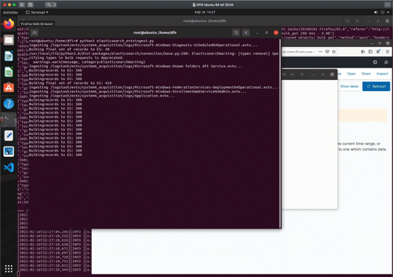

# offline-threat-hunting
 Digital Forensics Offline Threat Hunting

# Summary

Dragos made a nice parser for EVTX stream parsing into elasticsearch (https://www.dragos.com/blog/industry-news/evtxtoelk-a-python-module-to-load-windows-event-logs-into-elasticsearch/). While event logs would normally be ingested by the SIEM; in situtations where we are reviewing multiple systems for a common thread (example: Lateral movement of an APT) or situations where the ingestable data on the system may be different than what was ingested by the SIEM (example: system backup restoration, shadow copies, inadequate log ingestion tuning, etc.) it is important to have the data in front of us accessible and queriable. In particular this is attempting to tackle those threat hunting cases that span a large group of systems and yet require that timeline correlation accross ALL indexed instances.

# Changelog

- Intial entry, basic setup and 2 scripts

# Setup

## Components
- Ubuntu 20.04 LTS (Virtual Machine)
- Docker (version 19.03.8-0ubuntu1.20.04.2 at the time of writing)
- curl
- python3-pip
- evtxtoelk
- ELK Stack (using a docker image in this walkthrough from sebp https://hub.docker.com/r/sebp/elk/ sebp/elk latest, 7.10.0 at the time of writing)

## Installation
After installing the OS (Ubuntu 20.04), take the following steps:

### dependancies
1) <code bash> sudo apt update </code>

2) <code bash> sudo apt install docker.io </code>

3) <code bash> sudo apt install curl </code>

4) <code bash> sudo apt install python3-pip </code>

5) <code bash> sudo python3 -m pip install evtxtoelk </code>

6) Increase virtual memory for elasticsearch: 

    <code bash> sysctl -w vm.max_map_count=262144 </code>

    * NOTE: 262144 is the minimal value as elasticsearch requires at least 2GB to run
 
    * NOTE: https://www.elastic.co/guide/en/elasticsearch/reference/5.0/vm-max-map-count.html#vm-max-map-count

### ELK Stack
7) <code bash> sudo docker pull sebp/elk </code>

# Initial Operation
8) For the first execution of this docker container we are defining the parameters and will setup a much easier start/stop whenever we need this container again:

    <code bash> sudo docker run -p 9200:9200 -p 9300:9300 -p 5601:5601 --name elk sebp/elk </code>
    
    * NOTE: "-p" allows us to take the local listening port and make it accessible outside of that container

    * NOTE: "--name" allows us to call the container based on the name (example: perform '<code>docker stop elk</code>' or '<code>docker start elk</code>')

    * NOTE: You should now have a running ELK stack and you should be able to access the web UI from http://localhost:5601

9) Create the folder "/logstash/evtx" with accessible permissions. This will be the folder that we place our EVTX files for ingestion.
    
    <code bash> sudo mkdir /logstash /logstash/evtx </code>

    <code bash> sudo chmod -R 777 /logstash </code>

10) Disable/disconnet the network interface from the hyperviser. This virtual machine will not need network connectivity beyond this point.

# Continual Operation

11) Place the .EVTX file(s) into the /logstash/evtx folder

12) Use the included EVTXingest.py script as an elevated user 

    <code bash> sudo python3 EVTXingest.py</code>

    * NOTE: each evtx file that completes ingest without error will be DELETED from this folder

13) Create your index pattern via the web UI at http://localhost:5601

- Click on the hamburger button on the top left
- Click on 'Stack Management'
- Click on 'Index Patterns'
- Create and index paattern by using an 'index pattern name' of "hostlog*" and click on 'Next Step'
- From the dropdown window for 'time field' select 'body.@timestamp' and then click on 'Create index pattern'
- Click on the hamburger bar again on the top left and then click on 'discover'... you should now have queriable data!

14) (optional) If you need to wipe the data from elasticsearch, we can do that from the listening port 9200 via curl. Use the included cleardata.sh bash script as an elevated user to clear the only index used here 'host logs'

    <code bash> sudo ./cleardata.sh</code>

# Other Notes

## Detecting Lateral Movement (auth based)

https://github.com/ThreatHuntingProject/ThreatHunting/blob/master/hunts/lateral-movement-windows-authentication-logs.md

- Successful Logon (ID 4624)
- Failed Logon (ID 4625)
- Kerberos Authentication (ID 4768)
- Kerberos Service Ticket (ID 4776)
- Assignment of Administrator Rights (ID 4672)
- Unknown username or password (ID 529)
- Account logon time restriction violation (ID 530)
- Account currently disabled (ID 531)
- User account has expired (ID 532)
- User not allowed to logon to the computer (ID 533)
- User has not been granted the requested logon type (ID 534)
- The account's password has expired (ID 535)
- The NetLogon component is not active (ID 536)
- The logon attempt failed for other reasons (ID 537)
- Account lockout (ID 539)
